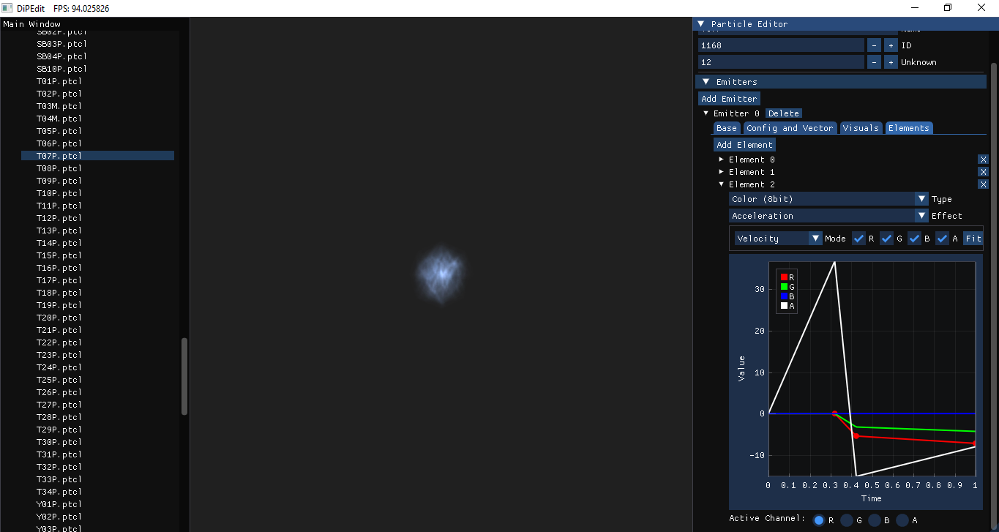

# DiPEdit:
A UI tool for editing and viewing Yakuza 1 and 2 ps2 particles.

# Usage:
Use [PTCLMan](https://github.com/Hamzaxx370/PTCLMan) to unpack a folder, then open the ui tool to choose that folder. a particle list to edit will appear.
