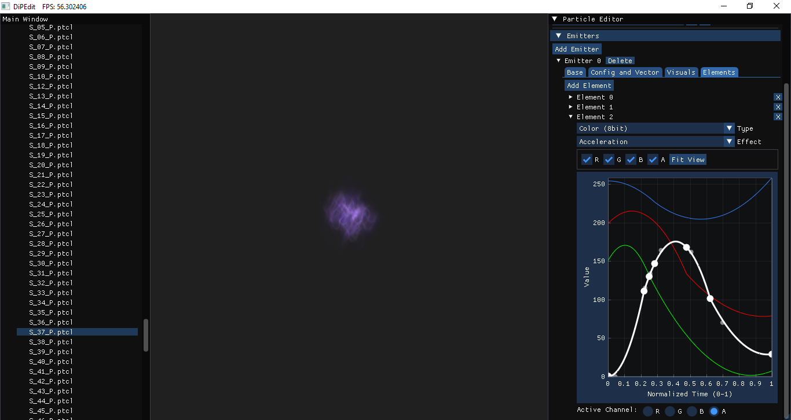
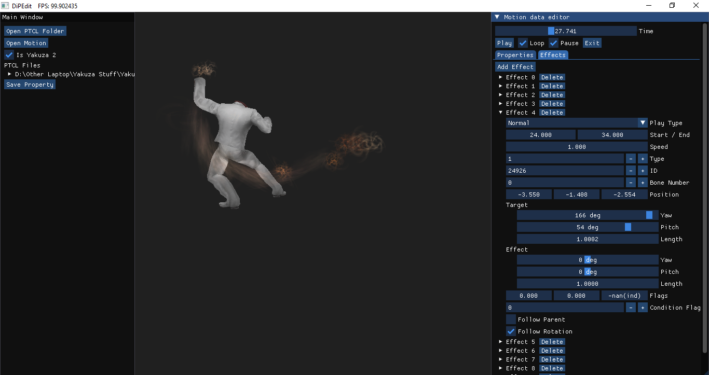
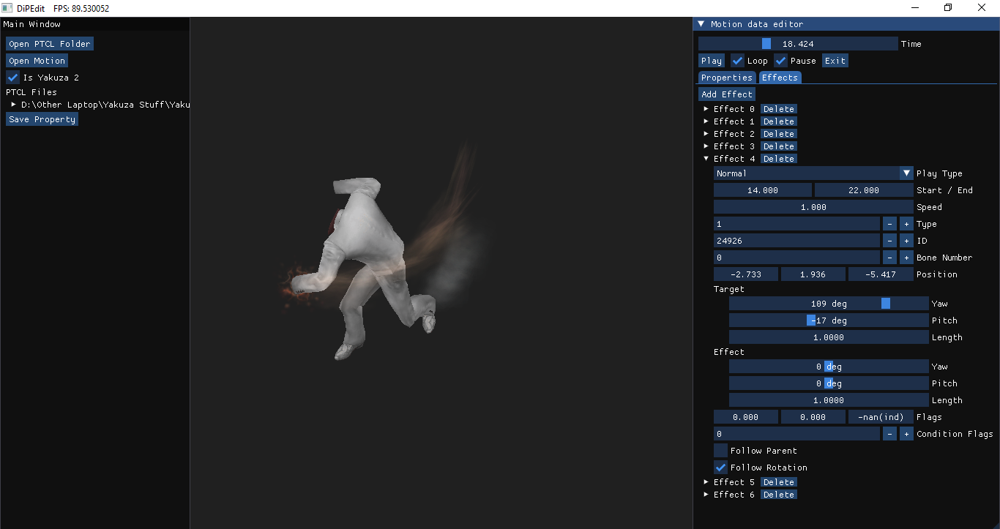
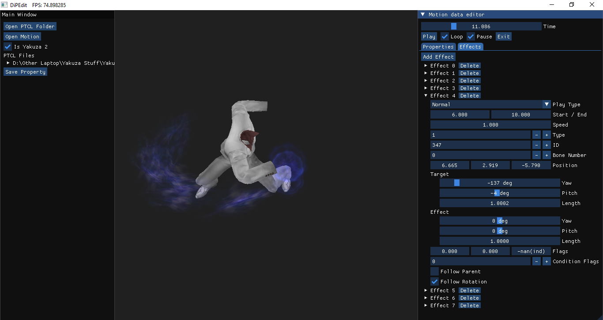

# DiPEdit:
A UI tool for editing and viewing Yakuza 1 and 2 ps2 particles as well as authoring battle motions.

# Usage:
- Move the mouse and hold right click to move the camera.
- Hold the up/down arrow to zoom in and out.
- For particle editing, use [PTCLMan](https://github.com/Hamzaxx370/PTCLMan) to unpack a folder, then open the ui tool to choose that folder. a particle list to edit will appear.
- For motion property editing, use [DATman](https://github.com/SamuraiOndo/DATman) to unpack the motion dat files, then choose a motion (0-number.dat) and then a property (1-number.dat).